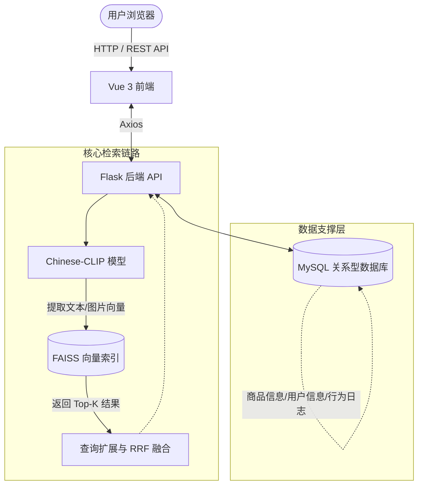

<div align="center">

# 🛒 Chinese-CLIP 商品图文检索系统

基于 [Chinese-CLIP](https://github.com/OFA-Sys/Chinese-CLIP) 的中文电商商品图文跨模态检索与推荐平台

[](https://www.python.org/)
[](https://vuejs.org/)
[](https://flask.palletsprojects.com/)
[](https://pytorch.org/)
[](https://github.com/facebookresearch/faiss)
[](LICENSE)

[**功能特性**](#-功能特性) •
[**系统架构**](#-系统架构) •
[**快速开始**](#-快速开始) •
[**API文档**](#-api-接口文档)

</div>

---

## 📖 项目简介

本项目为毕业设计开源项目。基于阿里达摩院强大的开源模型 **Chinese-CLIP**（中文 CLIP），并在 MUGE 电商数据集上进行了微调领域适应，旨在打造一个面向电商场景的**跨模态图文检索系统**。

用户不仅可以通过输入中文关键词（以文搜图）或上传商品截图（以图搜图）在海量商品库中实现毫秒级响应精准找货，系统还集成了完整的用户行为追踪体系，能够根据您的浏览、点击记录为您进行个性化的智能推荐。

---

## ✨ 功能特性

### 🔍 核心检索
- **智能文本搜索**：输入自然语言描述（如"复古风红色连衣裙"），基于 CLIP 文本编码器提取高维特征，通过 FAISS 余弦检索引擎快速找回最相似商品。
- **视觉图片搜索**：上传任意商品图片，基于 CLIP 图像编码器提取视觉特征，精准匹配商品库中具有相似视觉属性的商品。
- **智能查询扩展**：系统内置电商行业同义词词典，自动扩展搜索边界（如："运动鞋" 自动扩展为 跑步鞋、球鞋）。配合 **RRF（Reciprocal Rank Fusion）** 算法进行多路召回融合排名，显著提升检索召回率。

### 👤 用户系统与个性化
- 完善的账号体系，支持注册、登录、退出（密码 Bcrypt 强加密）与 Session 认证。
- 全链路用户行为追踪（记录搜索词交互、商品浏览与点击轨迹）。
- 基于历史行为权重的综合智能推荐算法生成千人千面的首页推荐流。
- 个人收藏夹的高效管理与状态同步。

### 🚀 架构与性能优化
- 高性能向量检索：FAISS FlatIP 索引预加载，并实现在首次构建后的磁盘持久化。
- 多级缓存机制：对于高频 CLIP 检索请求引入 **LRU 缓存**（命中缓存直接返回，不走模型计算）。
- 异步加载设计：重型 AI 模型及向量索引在**后台独立线程**异步加载，保证 Web 服务（Flask）的瞬间启动响应。

---

## 🛠 技术栈

| 模块 | 技术选型 |
|------|------|
| **前端应用** | Vue 3 + Vite + Element Plus + Vue Router |
| **后端服务** | Python 3 + Flask + Flask-Login + Flask-SQLAlchemy |
| **数据与存储** | MySQL 8.0 |
| **向量引擎** | FAISS（FlatIP 内积索引） |
| **AI 模型** | Chinese-CLIP ViT-B/16 + RoBERTa-base（基于 MUGE 微调） |

---

## ⚙️ 系统架构



---

## 📊 模型评测表现

本项目使用微调后的模型在 MUGE valid 验证集上进行了严格评测，主要评估指标为 Recall@1 / 5 / 10。核心表现如下：

- **Mean Recall (平均召回率)**：**76.09%**
- **Recall@1**：57.41%
- **Recall@5**：**82.07%** (相较R@1提升巨大，具备极高实用价值)
- **Recall@10**：88.80%

*结论：在实际部署中，默认展示 Top-5 或 Top-10 的检索结果即可达到极佳的命中覆盖率。*

---

## 📁 项目结构

```text
Chinese-CLIP/
├── app.py                      # Flask 核心路由与启动入口
├── image_searcher.py           # 图文跨模态检索核心逻辑封装
├── model_loader.py             # CLIP 模型权重与分词器单例加载
├── faiss_index.py              # FAISS 向量索引生命周期管理
├── query_expander.py           # 同义词查询扩展与多路 RRF 排序融合
├── dataset_transform.py        # MUGE 数据集预处理与转换工具
├── import_products_with_prices.py # 商品结构化数据入库脚本
├── frontend/image-search/      # Vue 3 前端工程源码
├── auth/                       # 用户鉴权与业务表模型模块
├── cn_clip/                    # Chinese-CLIP 官方核心模型库
└── run_scripts/                # 模型微调与分布式训练 Shell 脚本
```

---

## 🚀 快速开始

### 1. 环境准备

- 操作系统：Windows 10/11 / Linux / macOS
- 基础依赖：[Python >= 3.8](https://www.python.org/)、[Node.js >= 18](https://nodejs.org/)、[MySQL >= 8.0](https://www.mysql.com/)
- 硬件要求：推荐使用支持 CUDA (>= 11.1) 的 NVDIA 显卡以获得最佳推理体验。

#### 初始化 Python 虚拟环境与依赖：
```bash
conda create -n PyTorch python=3.8
conda activate PyTorch
pip install -r requirements.txt
# 请根据您的 CUDA 版本安装对应的 PyTorch
```

#### 初始化前端依赖：
```bash
cd frontend/image-search
npm install
```

### 2. 准备数据与权重

将下载好的微调权重及 MUGE 数据集图片放置如下，并确保在 `app.py` 顶部的配置项路径与之匹配：

```text
clip-data/
  ├── pretrained_weights/
  │   └── chinese-clip-vit-base-patch16/clip_cn_vit-b-16.pt
  └── datasets/MUGE/
      ├── extracted/imgs/                 # 海量商品图片目录
      └── json/train/train_imgs.img_feat.jsonl # 特征元数据
```

### 3. 配置与初始化数据库

新建 MySQL 数据库，并在 `app.py` 中修改 `SQLALCHEMY_DATABASE_URI`：
```sql
CREATE DATABASE image_search_db DEFAULT CHARSET=utf8mb4;
```
随后执行数据表的自动迁移及商品导入（确保虚拟环境已激活）：
```bash
python -c "from app import app, db; app.app_context().push(); db.create_all()"
python import_products_with_prices.py
```

### 4. 启动服务

**方法一：Windows 一键启动**
右键或在终端运行 `start.ps1`，脚本将自动拉起两个窗口分别映射 Flask 后端与 Vite 前端。

**方法二：手动启动**
```bash
# Terminal 1: 启动 Flask 后端
conda activate PyTorch
set KMP_DUPLICATE_LIB_OK=TRUE  # Windows 下避免 OpenMP 冲突
python app.py

# Terminal 2: 启动 Vue 前端
cd frontend/image-search
npm run dev
```
打开浏览器访问 [http://localhost:5173](http://localhost:5173) 即可体验！

---

## 📜 API 接口文档概览

本项目提供标准的 RESTful API 支持前后端分离调用。

| 模块 | 方法 | 路径 | 功能描述 |
|------|------|------|----------|
| **检索** | `POST` | `/api/search` | 基于文本相似度的商品检索 |
| **检索** | `POST` | `/api/image-search` | 基于上传图片的视觉相似度分析 |
| **用户** | `POST` | `/auth/login` | 账户鉴权登录 |
| **交互** | `POST` | `/api/favorites/add` | 将商品加入用户私人收藏夹 |
| **交互** | `POST` | `/api/behavior/click`| 异步记录用户商品点击行为 |
| **算法** | `GET`  | `/api/recommend` | 获取聚合用户行为的个性化推荐列表 |

*详细参数体系与响应范式请查阅 [app.py](app.py) 源码的路由装饰器部分。*

---

## 🤝 贡献规范

欢迎提交 Pull Request 或发起 Issue：
1. Fork 本仓库
2. 新建您的特性分支 (`git checkout -b feature/AmazingFeature`)
3. 提交您的修改 (`git commit -m 'Add some AmazingFeature'`)
4. 将修改推送到分支 (`git push origin feature/AmazingFeature`)
5. 开启一个 Pull Request

---

## 📄 许可证

本项目采用 [MIT License](LICENSE) 证书开源共享。
模型算法核心技术由 [Chinese-CLIP](https://github.com/OFA-Sys/Chinese-CLIP) 驱动并遵循其相关开源协议。

